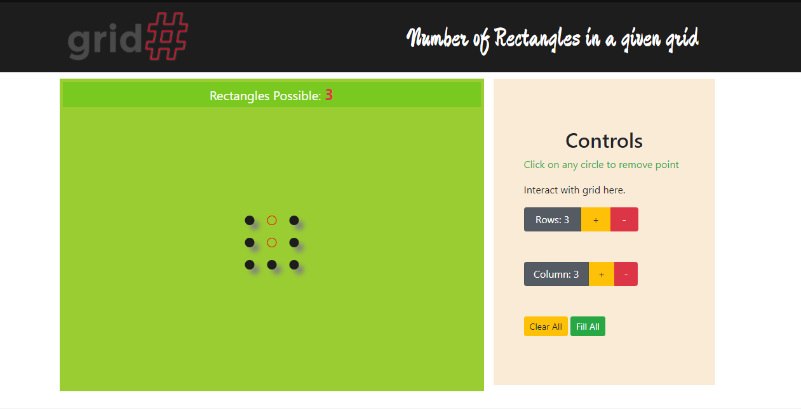

## Welcome to GitHub Pages

site is hosted here: https://aliwaqas333.github.io/Rectanges/

This tool visualizes the number of possible rectagles that can be drawn given a set of dots on xy axis. 

The algorithm used here can only process horizontal rectangles and does not account for rotated rectanges. I wish to integrate this feature in the future hopefully. 

Best of luck. 

enjoy
